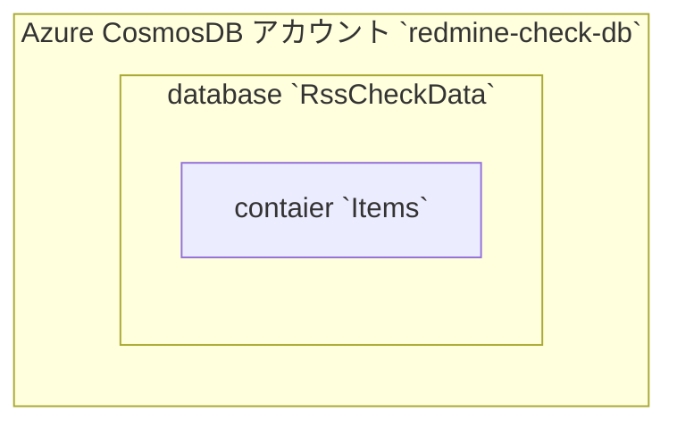

# 課題1：redmineの添付ファイル検知・処理呼び出しをAzure Functionsで行う

単発のFunctionsではなく、DurableFunctionsを使用します。この課題の後の処理もまとめてDurableFunctionsで管理する想定です。

## Azure CLI

※記載するコマンドの[]で囲んだ部分は、可変の値。環境や状況に合わせて変更する必要がある。

### インストール

[Azure CLI をインストールする方法](https://docs.microsoft.com/ja-jp/cli/azure/install-azure-cli)

### ログイン

```
az login
```

組織アカウント等で、Azureへのログオンを行う。

### 使うサブスクリプションを特定しておく

```
az account subscription list
```

サブスクリプションの一覧が出るので、使うサブスクリプション名をメモる。この後のコマンド全ての「[yourSubscription]」で使用する。

### 使えるリージョンを特定しておく

```
az account list-locations
```

たいてい[yourLocation]など日本の近いリージョンが使えると思うが、どこを使うかを決める。この後のコマンド全ての「[yourLocation]」で使用する。


## redmineの準備

1. redmineサーバーをAzure VMで作成
1. redmineの管理アカウントとテスト用ユーザーアカウントを作成
1. atomキーとapiキーを取得
1. テストで取得するために、プロジェクトとチケットを作成して添付ファイルを追加

### redmineサーバーをAzure VMで作成


※別ネットワークからのアクセスを想定した実験なので、パブリックIPを作成してNSGにも穴を空けてインターネットから通信できるようにする

#### RG作る

```
az group create --name [一意のResource Group名 例：RedmineTest1RG] --subscription [yourSubscription] --location [yourLocation]
```

#### Bitnami redmineのOSイメージを探す

https://docs.microsoft.com/en-us/azure/virtual-machines/linux/cli-ps-findimage

Bitnami redmineのimage一覧を取る

```
az vm image list --all --location japaneast --publisher Bitnami --offer redmine --output table
```

例えば次のような出力がある。このurnをVM作成時のimageとする

```
Offer    Publisher    Sku    Urn                               Version
-------  -----------  -----  --------------------------------  --------------
redmine  Bitnami      3      Bitnami:redmine:3:5.0.2112467525  5.0.2112467525
```

#### VM作る

※このコマンドは特に時間がかかる。10分以上かかることが多い

```
az vm create --name RedmineTest1 --resource-group RedmineTest1RG --subscription [yourSubscription] --admin-username localadmin --authentication-type ssh --generate-ssh-keys --image Bitnami:redmine:3:5.0.2112467525 --location [yourLocation] --public-ip-address-dns-name [一意のドメイン 例：redmine-test1-server] --public-ip-sku Basic --public-ip-address-allocation dynamic --size Standard_B1s --storage-sku StandardSSD_LRS 
```


##### VM自動シャットダウン設定

```
az vm auto-shutdown --time 1200 --name RedmineTest1 --resource-group RedmineTest1RG --subscription [yourSubscription] --email [yourEmail]
```

※webhookを別途作成しておいて--webhookオプションで指定するとさらに便利


##### NSGにHTTPアクセスの許可を通す

###### 事前の情報取得

自動作成されたNSGの名前を取得する。そのために、まずはNICを取得する。

```
az vm nic list --vm-name RedmineTest1 --resource-group RedmineTest1RG --subscription [yourSubscription]
```

コマンドを実行すると、以下のようにNICを取得できる。

```
[
  {
    "deleteOption": null,
    "id": "/subscriptions/guid/resourceGroups/RedmineTest1RG/providers/Microsoft.Network/networkInterfaces/RedmineTest1VMNic",
    "primary": null,
    "resourceGroup": "RedmineTest1RG"
  }
]
```

このうち、次の部分がNICのID。これをメモし、この後のコマンドに使用する。：/subscriptions/guid/resourceGroups/RedmineTest1RG/providers/Microsoft.Network/networkInterfaces/RedmineTest1VMNic

そのNICの情報を取得する。

```
az vm nic show --nic /subscriptions/guid/resourceGroups/RedmineTest1RG/providers/Microsoft.Network/networkInterfaces/RedmineTest1VMNic --vm-name RedmineTest1 --resource-group RedmineTest1RG --subscription [yourSubscription]
```

色々な情報が取れる中に、次のように紐付いているNSGの情報が含まれている。

```
  "networkSecurityGroup": {
    "defaultSecurityRules": null,
    "etag": null,
    "flowLogs": null,
    "id": "/subscriptions/guid/resourceGroups/RedmineTest1RG/providers/Microsoft.Network/networkSecurityGroups/RedmineTest1NSG",
    "location": null,
    "name": null,
    "networkInterfaces": null,
    "provisioningState": null,
    "resourceGroup": "RedmineTest1RG",
    "resourceGuid": null,
    "securityRules": null,
    "subnets": null,
    "tags": null,
    "type": null
  },
```

このうち、次の部分がNSGのID。/subscriptions/guid/resourceGroups/RedmineTest1RG/providers/Microsoft.Network/networkSecurityGroups/RedmineTest1NSG

このうち末尾のRedmineTest1NSGがNSG名なのでこれをメモし、この後のコマンドに使用する。

###### ソースIP・宛先ポート指定でルール追加

取得したNSGに対して、80ポートのアクセス許可を追加する。yourIP部分に、アクセスを許可するIPアドレス（アクセス元）を指定する。

priorityの値は、NSG内で一意の番号で優先順位を指定する必要がある。この場合は新規作成後なので、1001で通るはず。

```
az network nsg rule create --nsg-name RedmineTest1NSG --resource-group RedmineTest1RG --subscription [yourSubscription] --name http-allow-ip-1 --priority 1001 --destination-port-ranges 80 --access Allow --protocol TCP --direction Inbound --source-address-prefixes [yourIP]
```

###### ルール削除

追加したルールを削除したい場合は、次のようにルール名を指定して削除する。

```
az network nsg rule delete --nsg-name RedmineTest1NSG --resource-group RedmineTest1RG --subscription [yourSubscription] --name http-allow-ip-1

```


## CosmosDB作成

### CosmosDBアカウント作成

テスト用なので、課金が最小限になるサーバーレス・バックアップ2個以内で作成する

```
az cosmosdb create --resource-group RedmineTest1RG --subscription [yourSubscription] --name [一意のDB名：例 redmine-check-db] --backup-interval 1440 --backup-retention 48 --backup-policy-type Periodic --capabilities EnableServerless
```

### DB・コンテナ作成

CosmosDB内にdatabaseを作成し、その中にcontainerを作成する。

```
az cosmosdb sql database create --resource-group RedmineTest1RG --subscription [yourSubscription] --account-name [一意のDB名：例 redmine-check-db] --name RssCheckData
```

```
az cosmosdb sql container create --resource-group RedmineTest1RG --subscription [yourSubscription] --account-name [一意のDB名：例 redmine-check-db] --database-name RssCheckData --name Items --partition-key-path /date
```

以上で、次のような上下関係のコンテナが出来上がる。





### ConnectString確認

作成したCosmosDBへFunctionsからアクセスするために、ConnectStringを確認する。

```
az cosmosdb keys list --resource-group RedmineTest1RG --subscription [yourSubscription] --name [一意のDB名：例 redmine-check-db] --type connection-strings
```

次のように、2つの読み書き用ConnectStringと、2つの読み込み専用ConnectStringが返ってくるはず。今回の用途では読み書きが必要なので、"Primary SQL Connection String"を使用する。

```
{
  "connectionStrings": [
    {
      "connectionString": "AccountEndpoint=https://redmine-check-db.documents.azure.com:443/;AccountKey=Wl4frQDa～==;",
      "description": "Primary SQL Connection String"
    },
    {
      "connectionString": "AccountEndpoint=https://redmine-check-db.documents.azure.com:443/;AccountKey=Soaq～==;",
      "description": "Secondary SQL Connection String"
    },
    {
      "connectionString": "AccountEndpoint=https://redmine-check-db.documents.azure.com:443/;AccountKey=qcP4～==;",
      "description": "Primary Read-Only SQL Connection String"
    },
    {
      "connectionString": "AccountEndpoint=https://redmine-check-db.documents.azure.com:443/;AccountKey=go9d～==;",
      "description": "Secondary Read-Only SQL Connection String"
    }
  ]
}
```


### 作成後の確認

ここで、Azureポータルの方で作成したCosmosDBの中身を見ると理解が深まる。コマンドの内容と、Azureポータルに作成されたものを見比べて、ドキュメントなどの単語がどこに当たるのかを視覚的に理解すると良い。

Azureポータルを開き、上部の検索ウインドウなどから「Azure Cosmos DB」を開く。一覧に、コマンドで作成したCosmosDBアカウントが表示されているはず。（サブスクリプションなどのフィルタで非表示になっている場合があるので、注意）

CosmosDBアカウントを選択し、「データエクスプローラ」メニューを選択すると、作成したDatabaseおよびContainerが見えているはず。CosmosDBを使うには最低限これだけの構造が必要であること、この後にCosmosDBを読み書きした結果がここに反映されること、といった点を確認することで、理解の助けになるはず。


## DurableFunctions作成

1. VSのプロジェクト作成のテンプレートで、「Azure Functions」を選択
1. Functionの選択肢で「Dulable Functions Orchestration」を選択

この後は、「1_redmine-rss\1_redmine-rss\1_redmine-rss.sln」のコードを参考にするか、そのまま使用すると良い

### HttpStart

Function1.csのHttpStartが、HTTPトリガで動かす処理の入り口になっている。

次のように属性を与えると、HTTPトリガで呼び出すFunction名を変えることが出来る。

```csharp
[FunctionName("RSSPollingFuncLoop_HttpStart")]
        public static async Task<HttpResponseMessage> HttpStart(
```

StartNewAsyncの第1引数が呼び出すFunction名になるので、ここにDurableFunctionsのOrchestratorとして使いたいFunction名を指定する。次のようにすることで、「RSSPollingFuncLoop」というAzure Functionを呼び出す。

```csharp
string instanceId = await starter.StartNewAsync("RSSPollingFuncLoop", null);
```

### RunOrchestrator

Function1.csのRunOrchestratorが、DurableFunctionsのOrchestratorにあたる。

次のように属性を与えると、先ほど呼び出し処理を書いた「RSSPollingFuncLoop」というAzure Functionにできる。

```csharp

[FunctionName("RSSPollingFuncLoop")]
public static async Task RunOrchestrator(
    [OrchestrationTrigger] IDurableOrchestrationContext context)
```

### 処理に使用するデータ型の定義

データの入れ物として、次のクラスを作成する。

```csharp
    public class UpdateDocumentItem
    {
        public DateTime? Updated { get; set; }
        public string IssueId { get; set; }
        public string Title { get; set; }
    }
```


### CosmosDBを読み書きするFunction

ここでは実際のredmineの呼び出しを行う「RSSPollingFuncLoop」はまだ作成せず、固定の値を返す「RSSPollingFuncLoopDummy」というダミーを作成する。

#### 必要なライブラリの参照

NuGetでの参照に「Microsoft.Azure.WebJobs.Extensions.CosmosDB」を追加する。

```
<PackageReference Include="Microsoft.Azure.WebJobs.Extensions.CosmosDB" Version="3.0.10" />
```

#### メソッドの定義

Functionは、引数と戻り値をコード上で定義すると、それに従ってDIや入力バインド・出力バインドを行ってくれる。つまりFunctionsについて学んだ知識の多くは、メソッドの引数と戻り値の定義のところで使うことになる。次の定義を1つずつ解説する。

```csharp
public static async Task<(bool isChanged, IEnumerable<UpdateDocumentItem> updateEntry)> RSSPollingFuncDummy([ActivityTrigger] IDurableActivityContext context, ILogger log,
    [CosmosDB("RssCheckData", "Items",
        ConnectionStringSetting = "DbRssCheckDataConnectString",
        SqlQuery = "select * from UpdateDocumentItems d ORDER BY d.Updated DESC OFFSET 0 LIMIT 1")]
    IEnumerable<UpdateDocumentItem> updateDocumentLatest,
    [CosmosDB("RssCheckData", "Items",
        ConnectionStringSetting = "DbRssCheckDataConnectString")]
    IAsyncCollector<UpdateDocumentItem> updateDocumentOut)
```

##### DI

```csharp
[ActivityTrigger] IDurableActivityContext context, ILogger log
```

ここは決まり文句に近いもの。

DulableFunctionsからの呼び出しを行うので、IDurableActivityContextでそのコンテキストを受け取る。

また、ログの出力をするため、ILoggerを受け取る。

##### CosmosDB 入力バインド

```csharp
    [CosmosDB("RssCheckData", "Items",
        ConnectionStringSetting = "DbRssCheckDataConnectString",
        SqlQuery = "select * from UpdateDocumentItems d ORDER BY d.Updated DESC OFFSET 0 LIMIT 1")]
    IEnumerable<UpdateDocumentItem> updateDocumentLatest,
```

この定義により、Function呼び出しの時に入力バインドとしてCosmosDBへクエリを発行し、その結果を引数updateDocumentLatestに入れて呼び出すところまでを、Azure側で行ってくれる。

SqlQuery以外の引数では、CosmosDBのどこを読み書きするかを指定している。「CosmosDB作成」章でこれらを作成済みのはずなので、database名、container名、ConnectionStringの設定キー（後述）をここへ入れる。

SqlQueryでは、Updatedの日時で降順ソートして、最新のレコードを1つだけ取得する、という指定をしている。

##### CosmosDB 出力バインド

```csharp
[CosmosDB("RssCheckData", "Items",
    ConnectionStringSetting = "DbRssCheckDataConnectString")]
IAsyncCollector<UpdateDocumentItem> updateDocumentOut
```

この定義により、引数updateDocumentOutをCosmosDBへ出力バインドし、updateDocumentOutのメソッドでCosmosDBへの書き込みを行うことができる。引数は入力バインドと同様。

例：
```csharp
await updateDocumentOut.AddAsync(new UpdateDocumentItem
                    {
                        IssueId = "1",
                        Title = "Title1",
                        Updated = DateTime.UtcNow,
                    });
```


#### メソッドの実装

テスト用のメソッドとして、CosmosDBから取得できたレコードが0個だったら、1つ追加する。そうでなければ、何もしない。という処理を入れる。

```csharp

[FunctionName("RSSPollingFuncDummy")]
public static async Task RSSPollingFuncDummy([ActivityTrigger] IDurableActivityContext context, ILogger log,
    [CosmosDB("RssCheckData", "Items",
        ConnectionStringSetting = "DbRssCheckDataConnectString",
        SqlQuery = "select * from UpdateDocumentItems d ORDER BY d.Updated DESC OFFSET 0 LIMIT 1")]
    IEnumerable<UpdateDocumentItem> updateDocumentLatest,
    [CosmosDB("RssCheckData", "Items",
        ConnectionStringSetting = "DbRssCheckDataConnectString")]
    IAsyncCollector<UpdateDocumentItem> updateDocumentOut)
{
    log.LogInformation($"RSSPollingFunc Start");
    var updateLatest = updateDocumentLatest.FirstOrDefault();
    log.LogInformation($"RSSPollingFunc Start, Latest={updateLatest}");

    if (updateLatest != null)
    {
        return;
    }

    var addItems = new[]
    {
        new UpdateDocumentItem
        {
            IssueId = "1",
            Title = "Title1",
            Updated = DateTime.UtcNow,
        }
    };

    foreach (var item in addItems)
    {
        await updateDocumentOut.AddAsync(item);
    }

}
```

### ConnectionString

ConnectionStringの値をソースコードに直接書かず、jsonファイルから読み取らせるようにする。

プロジェクト上のlocal.settings.jsonファイルを開くと、"Values"があるはずなので、そこに追加する。

```json
{
    "IsEncrypted": false,
    "Values": {
      "AzureWebJobsStorage": "UseDevelopmentStorage=true",
      "FUNCTIONS_WORKER_RUNTIME": "dotnet",
      "DbRssCheckDataConnectString": "AccountEndpoint=～実際の値～;"
    }
}
```

DbRssCheckDataConnectStringというのは勝手に決めた変数名であり、他の値でも良い。これが、入力バインド・出力バインドに出てきた「設定キー」に当たる。

## DurableFunctionsを動かしてみる（デバッグ実行）

ここまでの実装を終えてビルドが通っていれば、デバッグ実行をすることができる。

デバッグ実行をすると、コンソールアプリが立ち上がり、その中で次のようにテスト実行用のローカルのURLが表示される。

```
Functions:

        RSSPollingFuncLoop_HttpStart: [GET,POST] http://localhost:7131/api/RSSPollingFuncLoop_HttpStart

        RSSPollingFuncLoop_HttpStop: [GET,POST] http://localhost:7131/api/RSSPollingFuncLoop_HttpStop

        RSSPollingFuncDummy: activityTrigger

        RSSPollingFuncLoop: orchestrationTrigger
```

このRSSPollingFuncLoop_HttpStartのURLにWebブラウザでアクセスする。成功すれば、次のようにILoggerで出力した内容を含めたログが出るはず。

```
[2022-07-06T08:48:09.354Z] Executing 'RSSPollingFuncLoop_HttpStart' (Reason='This function was programmatically called via the host APIs.', Id=d77293c8-990e-462a-b197-6210f5724829)
[2022-07-06T08:48:09.548Z] Started orchestration with ID = '48b1b5eccf044eab8ad91288fe60b35b'.
[2022-07-06T08:48:09.598Z] Executed 'RSSPollingFuncLoop_HttpStart' (Succeeded, Id=d77293c8-990e-462a-b197-6210f5724829, Duration=286ms)
[2022-07-06T08:48:09.743Z] Executing 'RSSPollingFuncLoop' (Reason='(null)', Id=74fc3db0-5f7c-4a45-855a-316a99ce4e29)
[2022-07-06T08:48:09.795Z] Executed 'RSSPollingFuncLoop' (Succeeded, Id=74fc3db0-5f7c-4a45-855a-316a99ce4e29, Duration=58ms)
[2022-07-06T08:48:12.148Z] Executing 'RSSPollingFuncDummy' (Reason='(null)', Id=3aae7646-1daa-4a1d-8059-a5de6ff9ce29)
[2022-07-06T08:48:12.151Z] RSSPollingFunc Start
[2022-07-06T08:48:12.152Z] RSSPollingFunc Start, Latest=
[2022-07-06T08:48:12.253Z] Executed 'RSSPollingFuncDummy' (Succeeded, Id=3aae7646-1daa-4a1d-8059-a5de6ff9ce29, Duration=2290ms)
[2022-07-06T08:48:12.584Z] Executing 'RSSPollingFuncLoop' (Reason='(null)', Id=6cc71ca8-378b-4be0-b3a5-b816463ee110)
[2022-07-06T08:48:12.593Z] Executed 'RSSPollingFuncLoop' (Succeeded, Id=6cc71ca8-378b-4be0-b3a5-b816463ee110, Duration=8ms)
```

ここまで上手く行ったら、CosmosDBの中身をAzureポータルなどで確認してみると良い（CosmosDBの「作成後の確認」の章を参照）。

ソースコード上で入れた値が、DB上に入っているはず。

## DurableFunctionsを動かしてみる（Azureへ発行）


※これ以降の記載は作成中


## redmineのAPI呼び出し

※これ以降の記載は作成中

### redmineのセットアップ

TODO：ssh接続してファイル開いて管理者パスワードを確認し、HTTPアクセスして管理者ログオンしてテスト用のプロジェクト・ユーザーを作る


### redmineからの情報取得


1. チェック対象の更新が含まれるようにしたRSSのURLと、RSSアクセス用のキーを用意
1. 


