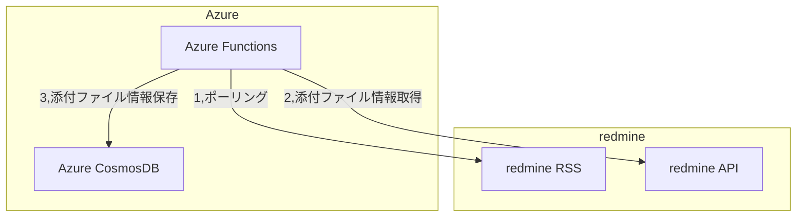

# Hands-on-az-204-equivalent

AZ-204の範囲に出てくる要素を実際に使ってみるハンズオンです。ただしAZ-204の範囲を網羅しているわけではなく、受験対策として効果があることを保証するものでもありません。

## 課題1：redmineの添付ファイル検知・処理呼び出しをAzure Functionsで行う

ログオンが必要なredmineのRSSをAzure Functionsでポーリングし、増えた添付ファイルを取得します。

その添付ファイルのパスを取得するところまで処理を行いますが、パスに対しての処理はこの課題では行いません。後の課題で行う予定です。

